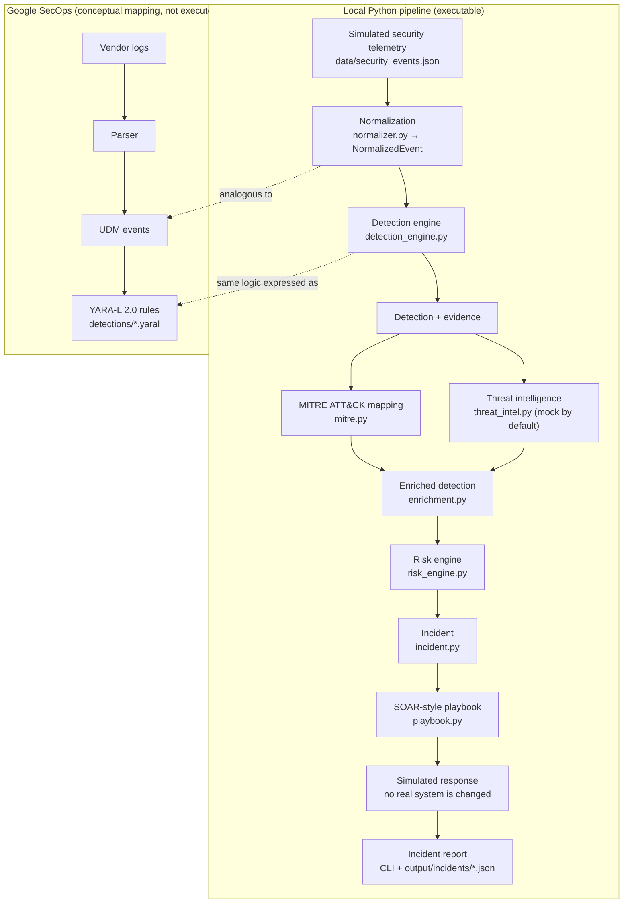

# SecOps Automation Lab

A local Detection Engineering and Security Automation lab written in Python. It simulates Windows and Linux security telemetry, normalizes vendor-specific events into one schema, and correlates them into behavioral detections with evidence. It then enriches each detection with MITRE ATT&CK and threat intelligence, calculates an explainable incident risk score, and runs SOAR-style playbooks whose response actions are **simulated**. It runs fully offline with no credentials.

Separately, [`detections/`](detections/) contains **YARA-L 2.0** versions of the three detections, written against Google SecOps UDM from official documentation. They are learning and portfolio material. They have not been deployed or validated in a Google SecOps tenant (see [Google SecOps / YARA-L](#google-secops--yara-l)).

**What it does**

- **Telemetry:** 45 simulated events from 5 log formats (OpenSSH, a Linux endpoint sensor, a firewall, Windows Security, Sysmon), covering two attack scenarios mixed with benign activity
- **Normalization:** vendor fields are mapped into one `NormalizedEvent` schema, with principal/target roles and the raw event preserved
- **Detection:** three multi-event behavioral detections, with deterministic evidence IDs, explainable confidence and documented false positives
- **Enrichment:** ATT&CK techniques that are only mapped when the evidence supports them, plus threat intelligence (offline mock by default, optional AbuseIPDB API)
- **Response:** a 0–100 incident risk score with listed contributors, a simulated SOAR playbook, and JSON incident reports
- **Google SecOps:** YARA-L 2.0 versions of the detections and a UDM mapping guide
- **Tests:** 286 pytest tests that run offline, including negative and false-positive cases

## Why This Project Exists

An individual event is rarely a conclusion. A failed login, a PowerShell process, a `curl` command or an outbound connection are all normal on their own. Detection engineering is about deciding **when a sequence of events justifies a conclusion**, how confident that conclusion is, and what to do about it.

The lab works through that chain end to end, at a size where every decision can be read and explained:

- **Telemetry and normalization:** different products describe the same activity differently, so events are normalized before any detection logic runs.
- **Events vs conclusions:** detections fire on correlated behavior (same host, user, process instance or file), never on a tool name alone.
- **False-positive awareness:** every detection documents benign explanations, and the dataset contains benign look-alikes that must not trigger.
- **Context vs evidence:** ATT&CK and threat intelligence add context. They never change the evidence, and threat intelligence alone cannot make an incident critical.
- **Explainability:** confidence, risk and playbook decisions are deterministic, with a reason attached to every point and action.
- **Safe automation:** response logic is fully simulated and separates recommendations from automated actions.

## Architecture



The dotted links are analogies. The YARA-L rules are not run by the Python pipeline, and the local schema is not UDM.

## Detections

| Detection | Behavior | Correlation | MITRE ATT&CK | Typical false positives |
|---|---|---|---|---|
| **Credential Attack Followed by Successful Authentication** | ≥ 5 failed logins against ≥ 3 accounts, then a successful login | same source IP and target host, 5-minute window | T1110 Brute Force (parent technique only; password reuse is not observable, so it is **not** labelled password spraying) | mistyped passwords, services with stale credentials, authorized scanners, shared NAT/VPN IPs |
| **Suspicious PowerShell Execution** | PowerShell with suspicious launch context (Office parent, `-EncodedCommand`, hidden window), plus follow-on DNS, external connection, file creation and execution by that process | host + PID + image + 5-minute window | T1059.001; T1027.010, T1564.003 and T1105 when that specific evidence is present | admin automation, deployment and management tools, approved Office macros |
| **Payload Download and Execution** | `curl`/`wget` writes a file, `chmod` adds execute permission, the **same file** runs, and optionally connects out | host + user + exact file path, ordered, 15-minute window | T1105 (external download source), T1059.004 (executed from a Unix shell) | install scripts, CI/DevOps automation, legitimate temporary installers |

Execution evidence is required: a download alone never produces a payload detection. Detection logic, confidence weights and correlation keys are documented in [docs/design.md](docs/design.md).

## Pipeline Walkthrough: One Incident

The Linux scenario exercises the whole pipeline. The excerpts below are real output of `python main.py`, re-wrapped and shortened in places.

**1. Telemetry.** Six failed SSH logins against six accounts from `203.0.113.45` are followed by a successful login as `deploy` on `web-prod-01`. That alone becomes a separate credential-attack detection. A shell session follows, and then:

```
- b6c1a716c90a  09:43:10.000  DOWNLOAD: curl wrote /tmp/.cache-update
- 51cce5b1ce67  09:43:11.000  file created: /tmp/.cache-update
- a8cce6c1e741  09:43:19.000  PERMISSION: chmod +x /tmp/.cache-update
- 87939fa6b08d  09:43:19.500  PERMISSION: mode of /tmp/.cache-update changed by chmod
- cc5d2ecdd2ac  09:43:24.000  EXECUTION: /tmp/.cache-update started
- 447edf4c110f  09:43:26.000  NETWORK: .cache-update connected to 198.51.100.77:8443
```

Each line is a normalized event, referenced by its deterministic `event_id`.

**2. Behavioral detection.** The detection only exists because these events share a host, a user and an exact file path, in the right order:

```
[HIGH] Payload Download and Execution        Confidence: 0.95
  On web-prod-01, user 'deploy' downloaded /tmp/.cache-update with curl, made it
  executable, and executed it 14 seconds after the download. The executed file then
  connected to 198.51.100.77:8443. Each step is common on its own; the sequence on one
  file is consistent with a downloaded payload being run and requires investigation.
  The destinations are not confirmed as malicious.
```

The external connection is reported as an external connection. It is **not** labelled command-and-control or exfiltration, because the telemetry does not show that.

**3. Enrichment, risk and the simulated playbook.** The resulting incident (from `python main.py --incidents-only`, slightly abridged):

```
[CRITICAL] Possible Payload Execution on Linux Host
    Incident ID:          INC-a9f0935911
    Detection:            Payload Download and Execution (DET-7240d82770)
    Host:                 web-prod-01
    User:                 deploy
    Detection confidence: 0.95
    Risk score:           98/100 (CRITICAL)

  Risk contributors:
    +38   detection_evidence: detection confidence 0.95 x 40 (6 correlated evidence events)
    +25   observed_outcome: downloaded file /tmp/.cache-update was executed
    +10   observed_outcome: outbound connection to external IP(s) by the executed code: 198.51.100.77
    +15   related_activity: related detection on web-prod-01 for user 'deploy' within 60 minutes:
          Credential Attack Followed by Successful Authentication (DET-61c034a14d)
    +10   threat_intel: 198.51.100.77 has MALICIOUS reputation (simulated intelligence, context only)

  MITRE ATT&CK:
    T1105 Ingress Tool Transfer, T1059.004 Command and Scripting Interpreter: Unix Shell

  Threat Intelligence:
    198.51.100.77: MALICIOUS - Mock Threat Intelligence (simulated)

  Playbook (simulated - no real system is changed):
    [SIMULATED ACTION] RECORD_INCIDENT: Record incident INC-a9f0935911
    [SIMULATED ACTION] ESCALATE_TO_ANALYST: Escalate INC-a9f0935911 to an analyst
    [SIMULATED ACTION] SIMULATE_ENDPOINT_ISOLATION: Isolate host web-prod-01
    [SIMULATED ACTION] SIMULATE_IP_BLOCK: Block IP 198.51.100.77
```

The threat-intelligence reputation is invented mock data. Without it the score is still 88, so it is not what makes the incident CRITICAL. The other two incidents (the PowerShell chain and the credential attack) score 78 and 76 (HIGH) and only receive *recommended* containment, which needs analyst approval.

## Quick Start

Requires Python 3 (developed and tested with Python 3.14; no newer-than-3.10 syntax is used, but older versions were not tested).

**Windows (PowerShell)**

```powershell
git clone https://github.com/Mathefss11/secops-automation-lab.git
cd secops-automation-lab
python -m venv .venv
.venv\Scripts\Activate.ps1
pip install -r requirements.txt

python -m pytest -v                  # run the test suite
python main.py --no-timeline         # offline demo: detections + incidents
python main.py --export              # write JSON reports to output/
```

If PowerShell blocks `Activate.ps1`, run `Set-ExecutionPolicy -Scope Process -ExecutionPolicy Bypass` in that window first. This affects the current session only.

**Linux / macOS**

```bash
git clone https://github.com/Mathefss11/secops-automation-lab.git
cd secops-automation-lab
python3 -m venv .venv
source .venv/bin/activate
pip install -r requirements.txt

python -m pytest -v
python main.py --no-timeline
python main.py --export
```

Dependencies are `requests` (used only by the optional AbuseIPDB provider) and `pytest`.

## Demo Commands

| Command | What it shows |
|---|---|
| `python main.py` | full run: event timeline, detections with evidence, incidents |
| `python main.py --no-timeline` | detections and incidents without the 45-event timeline |
| `python main.py --incidents-only` | compact incident summaries: risk, ATT&CK, threat intel, playbook |
| `python main.py --export` | also writes `output/normalized_events.json`, `output/detections.json` and `output/incidents/INC-*.json` |
| `python main.py --inspect <ID>` | one record as JSON: an event ID (e.g. `0910fc527510`), a detection (`DET-7240d82770`) or an incident (`INC-a9f0935911`) |
| `python main.py --threat-intel mock` | the default, stated explicitly: offline mock threat intelligence |

Threat intelligence uses the **offline mock provider by default**. The real AbuseIPDB API is only contacted when you ask for it explicitly:

```powershell
$env:ABUSEIPDB_API_KEY = "<your-key>"                       # bash: export ABUSEIPDB_API_KEY="<your-key>"
python main.py --threat-intel abuseipdb --no-timeline
python main.py --threat-intel abuseipdb --lookup-ip <public-ip>
```

The dataset's attacker IPs are documentation addresses, so the real provider reports them as *not publicly routable, not sent*. Use `--lookup-ip` to query a real public IP. If the key is not set, the CLI says AbuseIPDB was not queried, and the detections still run.

## Project Structure

```
secops-automation-lab/
├── data/security_events.json     simulated raw telemetry (5 vendor formats, 45 events)
├── src/
│   ├── normalizer.py             vendor parsers → NormalizedEvent (raw event preserved)
│   ├── command_analysis.py       parses PowerShell / curl / wget / chmod command lines (never executes)
│   ├── detection_engine.py       the three behavioral detections, evidence, confidence
│   ├── mitre.py                  evidence-conditional ATT&CK mapping
│   ├── threat_intel.py           mock + optional AbuseIPDB provider, error handling, cache
│   ├── enrichment.py             Detection + ATT&CK + threat intel → EnrichedDetection
│   ├── risk_engine.py            explainable 0–100 incident risk
│   ├── incident.py               Incident model and JSON report
│   └── playbook.py               SOAR-style policy → simulated actions
├── detections/*.yaral            YARA-L 2.0 versions of the detections (not tenant-validated)
├── docs/
│   ├── design.md                 detailed design reference
│   ├── google-secops.md          UDM / YARA-L mapping, rule walkthroughs, official references
│   └── interview-guide.md        technical review notes and demo flow
├── tests/                        pytest suite (offline; sockets blocked in conftest.py)
├── output/                       generated reports (git-ignored)
├── main.py                       CLI
└── requirements.txt
```

## Local Normalization vs UDM

```
Local:          vendor-style simulated logs → normalizer.py → NormalizedEvent → Python detections
Google SecOps:  vendor logs                 → parser        → UDM             → YARA-L rules
```

Both designs normalize mixed telemetry before detection, so the logic is written once against one schema. They are conceptually similar but not the same. **`NormalizedEvent` is NOT UDM.** It is a small educational schema (21 mostly flat fields, 6 event types), and its fields were not renamed to look like UDM.

## Google SecOps / YARA-L

- **What runs:** the executable detection pipeline is the local Python code.
- **What `detections/` contains:** YARA-L 2.0 versions of the same three behaviors, written against current Google SecOps documentation and Google's official example rules. They show how the same detection-engineering ideas are expressed against UDM-normalized telemetry.

| Python detection | YARA-L 2.0 rule |
|---|---|
| Credential Attack Followed by Successful Authentication | [`detections/credential_attack.yaral`](detections/credential_attack.yaral) |
| Suspicious PowerShell Execution | [`detections/suspicious_powershell.yaral`](detections/suspicious_powershell.yaral) |
| Payload Download and Execution | [`detections/payload_download_execution.yaral`](detections/payload_download_execution.yaral) |

The rules were **not** deployed to Google SecOps, **not** run in a tenant, and **not** checked with Google's `verifyRuleText` API. No tenant was available, and no official offline validator was found. Their field mappings depend on how each log source is parsed into UDM. [docs/google-secops.md](docs/google-secops.md) explains UDM and YARA-L, walks through each rule, and lists the assumptions, limitations and official references.

## Threat Intelligence

- **Mock provider (default):** deterministic and offline, so demos and tests are reproducible. Every result is labelled `Mock Threat Intelligence (simulated)` and carries `simulated: true`.
- **AbuseIPDB (optional):** a real reputation lookup through `requests`.
  - The API key comes from the `ABUSEIPDB_API_KEY` environment variable and is never stored, logged or exported.
  - Lookups use an explicit timeout.
  - Errors (authentication, rate limit, timeout, malformed JSON) become an `UNAVAILABLE` result instead of crashing the pipeline.
  - Results are cached in memory per run.
- **Never contacted by default:** there are no network requests unless `--threat-intel abuseipdb` is given.
- **Only real public IPs are sent.** Private, loopback and documentation-range addresses are refused before any request.
- **Context, not proof:** `MALICIOUS` does not prove compromise, and `UNKNOWN` does not mean benign.

## Risk Engine

| | Question |
|---|---|
| **Detection confidence** | How confident are we that the behavioral pattern occurred? |
| **Incident risk** | How concerning is the incident, given the observed behavior and the available context? |

The risk score is a deterministic sum of four capped categories:

| Category | Max points |
|---|---|
| detection evidence (confidence × 40) | 40 |
| observed outcome (account access, execution, outbound connection) | 35 |
| related activity (another detection, same host and user) | 15 |
| threat intelligence | 10 |

The levels are LOW below 40, MEDIUM 40–59, HIGH 60–79 and CRITICAL 80+. Signals already counted in confidence are not counted again, and threat intelligence can never be the only reason for CRITICAL. The full model is in [docs/design.md](docs/design.md#risk-engine).

## SOAR-Style Playbook

The playbook turns each incident into deterministic actions: record the incident, escalate it to an analyst, and either **recommend** or **simulate** containment, depending on the risk level and the affected entities.

| Detection | Possible containment |
|---|---|
| Credential attack | disable the account (only if a user is known), block the source IP (only if external) |
| PowerShell or payload | isolate the endpoint (only if a host is known), block the external destinations |

Automated (simulated) containment requires CRITICAL risk **and** detection confidence ≥ 0.80. Otherwise containment is only recommended for analyst approval.

**Every action is simulated.** `PlaybookAction.simulated` cannot be set to false, and no code path calls a firewall, EDR or identity system. In a real environment, actions such as isolating a production server or disabling a service account need business context and approval. A false positive there causes an outage.

## Testing

```bash
python -m pytest -v        # 286 tests, offline
```

| Area | Files |
|---|---|
| normalization | `test_normalizer.py` |
| command interpretation and safe PowerShell decoding | `test_command_analysis.py` |
| behavioral detections, including negative and false-positive cases | `test_detection_engine.py` |
| ATT&CK mapping, including techniques that must **not** be added | `test_mitre.py` |
| threat intelligence, API failure handling, key safety, caching | `test_threat_intel.py`, `test_enrichment.py` |
| risk scoring (bounds, determinism, no double counting, TI cap) | `test_risk_engine.py` |
| playbook policy and safety | `test_playbook.py` |
| incident reports and serialization | `test_incident.py` |
| YARA-L files | `test_yaral_static.py` |

`tests/conftest.py` blocks network sockets for every test, and all AbuseIPDB tests use faked HTTP responses. The YARA-L tests are **static checks** (structure, metadata, consistency with the Python mappings, documentation). They do **not** show that Google SecOps accepts the rules.

## Security Design Principles

- **Telemetry is untrusted data.** Command lines are parsed as strings and never executed or passed to a shell.
- **PowerShell `-EncodedCommand` values may be decoded** for analyst context. The decoded text is only displayed, never evaluated.
- **Simulated indicators are never contacted.** Attacker IPs and domains use documentation ranges and the reserved `.example` TLD.
- **The default run is offline.** The only network code is the optional AbuseIPDB provider, used only on request.
- **Credentials come from environment variables.** `.env` is git-ignored, and keys never appear in output or exceptions.
- **Response actions are simulations.** There are no response APIs in the codebase.

## Limitations

- **Simulated data:** the telemetry is simulated and small, a single day with 45 events. Real data volume, noise and parsing problems are not represented.
- **Simplified normalization:** 5 hand-written parsers, with domain names stripped from usernames, and no host-to-IP mapping (firewall events have no hostname).
- **Illustrative scoring:** the confidence weights and risk weights are lab choices, not tuned on real data.
- **No asset context:** there is no asset inventory or criticality, no user context and no business impact. Isolating a production web server is treated like any other host.
- **No persistence:** there is no storage, case management or cross-run state, and the cache lasts for one run only.
- **No real integrations:** there are no real response integrations; every action is simulated.
- **Optional AbuseIPDB:** the AbuseIPDB integration is not needed for the demo. It was implemented from the API documentation and tested with faked responses.
- **YARA-L is unvalidated:** the YARA-L rules need validation in a live Google SecOps tenant, and UDM field availability depends on the log source and its parser.
- **Not production software:** this is an educational and portfolio lab, not production SOC software.

## Documentation

- [docs/design.md](docs/design.md): normalized schema, log sources, detection logic, confidence weights, correlation, ATT&CK mapping decisions, threat-intelligence and API handling, risk model, playbook policy, incident report format
- [docs/google-secops.md](docs/google-secops.md): Google SecOps, UDM and YARA-L, comparison with the local pipeline, rule walkthroughs, limitations, official references
- [docs/interview-guide.md](docs/interview-guide.md): technical Q&A about the design and a short demo flow

## Disclaimer

All telemetry, users, hosts and threat intelligence in this repository are **simulated**. The project does not monitor, query or modify any real system, other than the optional AbuseIPDB lookups you explicitly request.
